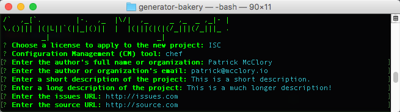

# generator-bakery [![NPM version][npm-image]][npm-url] [![Build Status][https://travis-ci.org/datapipe/generator-bakery.svg?branch=master]][https://travis-ci.org/datapipe/generator-bakery] [![Dependency Status][daviddm-image]][daviddm-url]
> AWS Image Repo generator for building consistent AMI&#39;s

## Installation

First, install [Yeoman](http://yeoman.io) and generator-bakery using [npm](https://www.npmjs.com/) (we assume you have pre-installed [node.js](https://nodejs.org/)).

```bash
npm install -g yo
npm install -g generator-bakery
```

Then generate your new project:

```bash
yo bakery <project_name>
```

## Chef Users

* Check out the Packer provisioner details for [chef-solo](https://www.packer.io/docs/provisioners/chef-solo.html) if you want to extend the process provided out of the box.

## Puppet Users

* Check out the Packer provisioner details for [puppet-masterless](https://www.packer.io/docs/provisioners/puppet-masterless.html) if you want to extend the process provided out of the box.

## Getting To Know Yeoman

 * Yeoman has a heart of gold.
 * Yeoman is a person with feelings and opinions, but is very easy to work with.
 * Yeoman can be too opinionated at times but is easily convinced not to be.
 * Feel free to [learn more about Yeoman](http://yeoman.io/).

## General workflow

### Source Control Management

One of the key points of this solution is that we must manage how we build AMI's both in a central place but also in a way that allows us to:

* View history
* Provide Peer Review
* Manage collaborative work between multiple engineers in the same structure

Therefore, we've baked in the idea of utilizing a source code repository as the storage medium for these projects by default. We initially are supporting both [Github](https://github.com) and [Github Enterprise](https://enterprise.github.com/home).

### Configuration Management

Overall, we support the following means of applying configuration to machines when building images:

* [Chef](http://chef.io)
* [Puppet](http://puppetlabs.com)
* Bash Scripts (^nix support)
* Powershell Scripts (Windows Support)

We're using this project to create repositories containing code intended to build an AMI in AWS. This means that we're targeting a specific OS and a specific usecase, application or purpose. We also fully believe that we shouldn't reinvent the wheel, so we're heavily leveraging tooling from the open source community and providing options that should offer the majority of users a path forward.

That being said, since this is a focused usecase, especially when it comes to concepts such as configuration management tooling, while they do support multiple operating systems, our goal is to use Chef and Puppet more as a way to compose other components from their respective communities. While not a 'pure' implementation of the tools, we tend to make assumptions around OS-specfic environments that we wouldn't otherwise make in more generally-focused components.

For more basic configurations, using direct scripting either via bash or PowerShell, the tooling expects that each script logs data to STDOUT and error information to STDERR while still respecting the exit code for success or failure overall. Non-zero exit codes are interpreted as failures and will stop an image build.

### Image Management

We're using [Packer](http://packer.io) to collect and apply our configuration assets before creating an image in AWS. The setup and configuration of this respects the Configuration Management options selected and, unlike other parts of this solution, the packer file itself is dynamically generated vs. being driven through a template.

These scripts are designed to be used with a single configuration management tool to start, though manual editing post-generation could certainly achieve a multi-tool based approach. More information on how to format this script is available within [Packer's documentation](https://www.packer.io/docs):

* [Shell Provisioner](https://www.packer.io/docs/provisioners/shell.html)
* [Powershell Provisioner](https://www.packer.io/docs/provisioners/powershell.html)
  * [Windows Restart](https://www.packer.io/docs/provisioners/windows-restart.html)
* [Chef Solo](https://www.packer.io/docs/provisioners/chef-solo.html)
* [Puppet Masterless](https://www.packer.io/docs/provisioners/puppet-masterless.html)
* [File Uploads](https://www.packer.io/docs/provisioners/file.html)

### Screenshot Walkthrough





## Testing
Tests should be written in the test/ directory. Currently gulp is configured to run [Mocha](https://mochajs.org/) tests. Tests can be run with the command ```gulp test```. For convenience a testing.sh.example file is provided in the top level directory. This is a template which shows environment variables which should be set (containing things like AWS and Git credentials) to run the tests.

## License

ISC © [Datapipe](https://datapipe.com/)

[npm-image]: https://badge.fury.io/js/generator-imagebuild.svg
[npm-url]: https://npmjs.org/package/generator-imagebuild
[travis-image]: https://travis-ci.org/datapipe/generator-imagebuild.svg?branch=master
[travis-url]: https://travis-ci.org/datapipe/generator-imagebuild
[daviddm-image]: https://david-dm.org/datapipe/generator-imagebuild.svg?theme=shields.io
[daviddm-url]: https://david-dm.org/datapipe/generator-imagebuild
